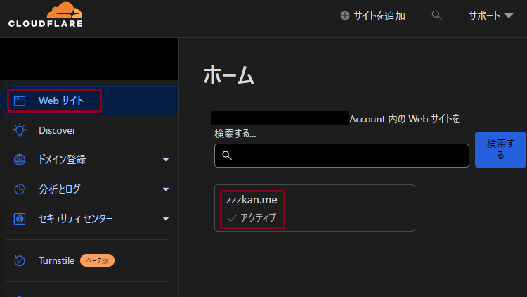
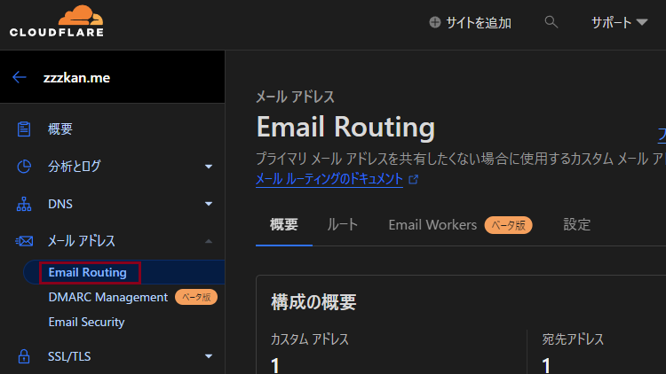

追記：MailChannels を用いる方法は現在では非推奨になっています。

> MailChannels have deprecated the free email sending API for Cloudflare Workers and will begin rejecting API calls from June 30th 2024 at 1700 PDT: https://support.mailchannels.com/hc/en-us/articles/26814255454093-End-of-Life-Notice-Cloudflare-Workers

現時点（2024/08/05）でメール送信は[Resend](https://resend.com/)を用いる方法がおすすめです。

---

Cloudflare はドメインのカスタムメールアドレスから問い合わせフォームまでを簡単にしかも無料で作ることができてすごいです。最近、問い合わせフォームを設置してみようとふと思い立ったのでやってみました。

## カスタムメールアドレス

[Cloudflare Email Routing](https://www.cloudflare.com/ja-jp/products/email-routing/)を用いて簡単に設定できます。これは名前の通りメールのルーティングを行うサービスで、誰でも無料で利用できます。

使い方としては、この Cloudflare Email Routing を用いてカスタムメールアドレスを設定し、このメールを Gmail や Outlook などのメールサービスで受け取るように設定しておきます。こうするとドメイン維持費だけでカスタムメールアドレスを利用できます。すごい。

### 設定方法

1. ダッシュボード > Web サイトからドメインを追加
   
   ちなみに[Cloudflare Registrar](https://www.cloudflare.com/ja-jp/products/registrar/)は原価でドメインを提供していてこれまたおすすめ
2. ドメイン > メールアドレス > Cloudflare Email Routing でいろいろ設定
   
   基本的に指示通りに設定していくだけ
3. （送信設定まで行う場合）カスタムメールアドレスと使用するメールサービスを紐づけ

## 問い合わせフォーム

似たようなサービスとして[Netlify Forms](https://www.netlify.com/products/forms/)が有名だと思いますが Cloudflare でも同様なことができます。

Cloudflare は [MailChannels](https://www.mailchannels.com/)というメール配信サービスとパートナーシップを結んでいて、追加のアカウントの作成等なしに、Workers からメールを送信できます。この MailChannels 自体ありがたいことに無料で利用できます。一応 Workers を使うのでリクエスしすぎには注意ですが、無料枠たくさんあるので大丈夫でしょう。

問い合わせフォームを作るには、フォームの作成とメール送信を行う Worker を作成する必要があるのですが、[MailChannels Pages Plugin](https://developers.cloudflare.com/pages/platform/functions/plugins/mailchannels/)というプラグインが用意されていて簡単に作成できます。ドキュメントを見てもらえば作成できると思いますがせっかくなので軽く書いておきます。

### Pages

フォーム自体は Cloudflare Pages 上に置きます。適当にプロジェクトを作成し、以下のような html を /public/contact.html などとして作成します。

```html
<body>
  <form data-static-form-name="contact">
    <label for="name">Name: </label>
    <input type="text" name="name" />
    <label for="email">Email: </label>
    <input type="email" name="email" />
    <label for="message">Message: </label>
    <textarea name="message"></textarea>
    <button type="submit">Send</button>
  </form>
</body>
```

### Pages Functions

Pages Functions とはようするに Pages プロジェクト上に設置できる Workers です。具体的には /functions 配下にスクリプトを配置します。今回の場合は以下のようなスクリプトを /functions/\_middleware.ts として作成します。

```ts
import mailChannelsPlugin from "@cloudflare/pages-plugin-mailchannels";

export const onRequest: PagesFunction = mailChannelsPlugin({
  personalizations: [
    {
      to: [{ email: "contact@example.com" }],
    },
  ],
  from: {
    name: "example.com",
    email: "noreplay@example.com",
  },
  respondWith: () => {
    return new Response(`Thank you for submitting your enquiry.`);
  },
});
```

personalizations が送信先、from が送信元の情報になります。他にも cc など情報も設定できるようです。詳細は[Transactional API](https://api.mailchannels.net/tx/v1/documentation)を見てみてください。

これで必要最低限の実装で問い合わせフォームを作成できました。ここまで 30 分もかからなかったと思います。とりあえず満足です。

### （補足）送信ドメイン認証

送信元メールアドレスは簡単に詐称（なりすまし）できるため、 Sender Policy Framework（SPF）や DomainKeys Identified Mail（DKIM）といった認証が利用されます。これらが正しく設定されていない場合、メールがスパムとして判定される場合があるので注意が必要です。

## 参考

- [Outlook で Cloudflare Email Routing を設定する](https://zenn.dev/honahuku/articles/outlook_set_cf_mail_routing)
- [Send email using Workers with MailChannels](https://blog.cloudflare.com/sending-email-from-workers-with-mailchannels/)
- [Cloudflare Pages でお問い合わせフォーム（自動返信あり）を作る - Shinobi Works の Web ブログ](https://shinobiworks.com/blog/653/)
- [DMARC、DKIM、SPF とは何ですか？ | Cloudflare](https://www.cloudflare.com/ja-jp/learning/email-security/dmarc-dkim-spf/)
