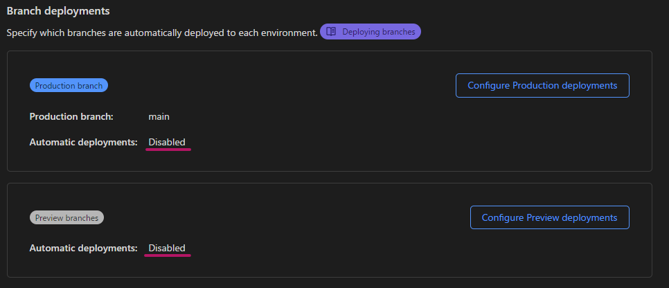

このブログは Gatsby + Cloudflare Pages という構成で作られています。Gatsby のバージョンとしては現在最新の v5 を利用しているのですが Gatsby v5 では[Node 18](https://www.gatsbyjs.com/docs/reference/release-notes/v5.0/#node-18)が必要です。これを Cloudflare Pages でビルドしようとすると Node 18 のインストールで失敗してしまいます。

```log
00:48:06.434 Attempting node version '18' from .nvmrc
00:48:07.946 Downloading and installing node v18.12.1...
00:48:08.356 Downloading https://nodejs.org/dist/v18.12.1/node-v18.12.1-linux-x64.tar.xz...
00:48:08.813 Computing checksum with sha256sum
00:48:08.950 Checksums matched!
00:48:13.033 node: /lib/x86_64-linux-gnu/libm.so.6: version `GLIBC_2.27' not found (required by node)
00:48:13.033 node: /lib/x86_64-linux-gnu/libc.so.6: version `GLIBC_2.25' not found (required by node)
00:48:13.033 node: /lib/x86_64-linux-gnu/libc.so.6: version `GLIBC_2.28' not found (required by node)
00:48:13.084 nvm is not compatible with the npm config "prefix" option: currently set to ""
00:48:13.085 Run `npm config delete prefix` or `nvm use --delete-prefix v18.12.1` to unset it.
00:48:13.086 Failed to install node version '18'
```

## Cloudflare Pages で利用可能な Node バージョン

現在 Cloudflare Pages で利用可能な Node バージョンを確認するとそもそも v17 までで v18 は非対応でした。

> Any version up to 17.x

[Build configuration · Cloudflare Pages docs](https://developers.cloudflare.com/pages/platform/build-configuration)

Node 18 への対応は次期ビルドイメージで対応される予定のようです。次期ビルドイメージについては[Build Image Update · Discussion #1 · cloudflare/pages-build-image](https://github.com/cloudflare/pages-build-image/discussions/1)で議論されています。新しい Node にいつ対応されるのかという話題はかなりあがっていて、一応 Maintainer の方が以下のように発言されているのでそのうち対応されるはずです。

> We know. We didn't expect it to be this long. We use Pages just like all of you and feel the pain ourselves. It's coming is all I can say right now.

ちなみに現状最もサポート期限が長い Node 16 が 2023 年 9 月 11 日でサポート期間満了（EoL）になる予定なのでそれまでにはリリースされると信じたいです。

## GitHub Actions でビルドする

現状 Cloudflare Pages では Gatsby v5 をビルドできないことがわかりました。ただ、次期ビルドイメージがリリースされるのを待つわけにもいかないです。なので GitHub Actions でビルドすることにします。

幸いにも [Cloudflare 公式の Action](https://github.com/marketplace/actions/cloudflare-pages-github-action) があったので今回はこちらを利用しました。基本的な使い方は Action の Readme に記載されているのでここでは割愛します。

Action 導入後、Cloudflare Pages 側での自動デプロイは不要となるためオフにしておきます。具体的には\[Setting\]>\[Builds & deployments\]>\[Branch deployments\]>\[Automatic deployments\]を\[Disabled\]に設定します。



以上で Gatsby v5 製のサイトを Cloudflare Pages へデプロイする環境が整いました。やったね。

## 参考

- [GitHub Actions でビルドして Cloudflare Pages にデプロイする](https://zenn.dev/nwtgck/articles/1fdee0e84e5808)
