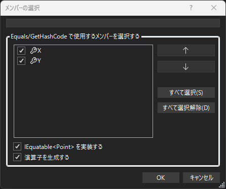

C#においてクラスは参照型なので`Equals{:txt}`や`=={:txt}`では参照の等価性（参照が同一か）が評価されます。クラスを値の等価性（値が同一か）で評価したい場合は別の実装が必要になります。また、構造体は値型で値の等価性を評価しますがこの際 boxing が発生したりなどでパフォーマンスが落ちます。そのため構造体の場合もやはり別の実装をした方が良いこと多いです。

このようなとき必要となる実装をたまによく忘れるのでここに書いておくことにします。

## レコードを使う

クラスに値の等価性が必要な場合は`class{:txt}`ではなく`record{:txt}`（または`record class{:txt}`）を使います。構造体の場合は`struct{:txt}`ではなく`record struct{:txt}`を使います。

```cs
public record Point(int x, int y);
```

（完）

[レコード](https://learn.microsoft.com/ja-jp/dotnet/csharp/fundamentals/types/records)便利ですね。ただ、レコードが導入されたのは C# 9 から（`record struct{:txt}`は C# 10 から）なので、たとえば .NET Framework なプロジェクトでは（基本的には）レコードを使うことができない…悲しい。

## Visual Studio で自動実装する

レコード型使えない民はどうしたらよいのでしょうか。Visual Studio で自動実装しましょう。ここでは Visual Studio 2022 を使用した場合を示します。例えば以下のクラスについて考えます。

```cs
public class Point
{
    public int X {get;}
    public int Y { get; }
    public Point(int x, int y)
    {
        X = x;
        Y = y;
    }
};
```

このクラスで\[クイック アクションとリファクタリング\] > \[Equals および GetHashCode を生成する\]を選択します。すると以下のようなダイアログが表示されます。



まず、等価性の定義に用いるメンバーへチェックを入れます。今回の場合 X および Y いずれの値も一致しているときを"等しい"としたいためどちらにもチェックを入れています。次に、「`IEquatable<T>{:txt}`を実装する」は文字通りの意味ですがこれは基本的にチェックを入れて良いと思ってます。最後に、「演算子を生成する」も文字通りの意味ですがこれもたいていの場合（とくに immutable なクラスや構造体の場合）はチェックを入れて良いと思っています。チェックを入れなかった場合`Equals{:txt}`と`=={:txt}`で結果が変わることになります。

以上を行うと以下のように自動実装されます。

（追記：.NET Framework な話をしているのになぜか Null 許容参照型が有効になってるの許して）

```cs {1, 11-36}
public class Point : IEquatable<Point?>
{
    public int X {get;}
    public int Y { get; }
    public Point(int x, int y)
    {
        X = x;
        Y = y;
    }

    public override bool Equals(object? obj)
    {
        return Equals(obj as Point);
    }

    public bool Equals(Point? other)
    {
        return other is not null &&
               X == other.X &&
               Y == other.Y;
    }

    public override int GetHashCode()
    {
        return HashCode.Combine(X, Y);
    }

    public static bool operator ==(Point? left, Point? right)
    {
        return EqualityComparer<Point>.Default.Equals(left, right);
    }

    public static bool operator !=(Point? left, Point? right)
    {
        return !(left == right);
    }
}
```

楽ちんですね。

## （おまけ）自分で書く

自動実装できたものの何が実装されているのかよくわからないので自分でも書いてみます。例によって以下のクラスについて考えます。

```cs
public class Point
{
    public int X {get;}
    public int Y { get; }
    public Point(int x, int y)
    {
        X = x;
        Y = y;
    }
};
```

### IEquatable\<T\>の実装

まずは型固有の`Equals{:txt}`を定義するため[`IEquatable<T>{:txt}`](https://learn.microsoft.com/ja-jp/dotnet/api/system.iequatable-1)を実装いてみます。

```cs {1, 11-16}
public class Point : IEquatable<Point?>
{
    public int X {get;}
    public int Y { get; }
    public Point(int x, int y)
    {
        X = x;
        Y = y;
    }

    public bool Equals(Point? other)
    {
        return other is not null &&
               X == other.X &&
               Y == other.Y;
    }
};
```

ここで実装した`IEquatable<T>.Equals{:txt}`は`List<T>.Contains{:txt}`などで等価性を評価する場合でも用いられるようになります。

### Object.Equals のオーバーライド

型固有の`Equals{:txt}`は定義できましたが現状`Object.Equals{:txt}`は考慮されていません。たとえば、`new Point(1, 2).Equals((object)new Point(1, 2)){:cs}`は現状では False となります。そこで`Object.Equals{:txt}`をオーバーライドします。

```cs {11-14}
public class Point : IEquatable<Point?>
{
    public int X {get;}
    public int Y { get; }
    public Point(int x, int y)
    {
        X = x;
        Y = y;
    }

    public override bool Equals(object? obj)
    {
        return Equals(obj as Point);
    }

    public bool Equals(Point? other)
    {
        return other is not null &&
               X == other.X &&
               Y == other.Y;
    }
};
```

これで`IEquatable<T>.Equals{:txt}`と`Object.Equals{:txt}`の動作が一致します。ところで、`Object.Equals{:txt}`があるのでわざわざ`IEquatable<T>.Equals{:txt}`は不要なのではと思えてきますが、型がつくし boxing もなくなるので基本的に`IEquatable<T>.Equals{:txt}`を実装したほう良さそうです。

### Object.GetHashCode のオーバーライド

次にやらなければならないのが`Object.GetHashCode{:txt}`のオーバーライドです。これは等しい 2 つのオブジェクトは等しいハッシュコードを返す必要があるためです。現状では`Dictionary<Point,TValue>{:txt}`なんかは意図した動作にならないです。

```cs {23-26}
public class Point : IEquatable<Point?>
{
    public int X {get;}
    public int Y { get; }
    public Point(int x, int y)
    {
        X = x;
        Y = y;
    }

    public override bool Equals(object? obj)
    {
        return Equals(obj as Point);
    }

    public bool Equals(Point? other)
    {
        return other is not null &&
               X == other.X &&
               Y == other.Y;
    }

    public override int GetHashCode()
    {
        return HashCode.Combine(X, Y);
    }
};
```

### 演算子のオーバーロード

最後に必要に応じて演算子`=={:txt}`, `!={:txt}`をオーバーロードします。現状では`Equals{:txt}`と`=={:txt}`で動作が異なります。

```cs {28-36}
public class Point : IEquatable<Point?>
{
    public int X {get;}
    public int Y { get; }
    public Point(int x, int y)
    {
        X = x;
        Y = y;
    }

    public override bool Equals(object? obj)
    {
        return Equals(obj as Point);
    }

    public bool Equals(Point? other)
    {
        return other is not null &&
               X == other.X &&
               Y == other.Y;
    }

    public override int GetHashCode()
    {
        return HashCode.Combine(X, Y);
    }

    public static bool operator ==(Point? left, Point? right)
    {
        return EqualityComparer<Point>.Default.Equals(left, right);
    }

    public static bool operator !=(Point? left, Point? right)
    {
        return !(left == right);
    }
}
```

ちなみにここで出てくる`EqualityComparer<T>.Default.Equals{:txt}`は、 T が`IEquatable<T>{:txt}`を実装していれば`IEquatable<T>.Equals{:txt}`を使用し、それ以外は`Object.Equals{:txt}`を使用します。どこかで聞いたことがあるような仕組みですね。

これで Visual Studio で自動実装した実装になりました。長かった。

### （余談）null チェックと演算子のオーバーロード

C#には null チェックを行う方法がいくつかあります。よく使われるのは`hoge == null{:cs}`のように演算子を利用する方法でしょうか。この方法には実は罠があって、それは今回のように演算子をオーバーロードしたときです。

演算子をオーバーロードしているときに`hoge == null{:cs}`と書いてしまうとオーバーロード先の処理が呼ばれてしまいます。オーバーロード先の処理が重かったりすると無駄に時間がかかることになります。さらにまずいのは以下のようにオーバーロードしてしまうことです。

```cs
...
public static bool operator ==(Point? left, Point? right)
{
    return !(left == null) && left.Equals(right);
}
...
```

個人的には思わず書いてしまいそうになるのですがこれは`StackOverflowException{:txt}`になります。ようするに無限ループになります。演算子の中で演算子を呼んでいるのでまあよく考えたら当然ですね。

個人的には単に null チェックをしたいだけなのであれば演算子は使わないほうが無難な気もしています。こういとき昔ながらの方法は`ReferenceEquals(hoge, null){:cs}`になるんですがなんかちょっといけてない気がします。最近の C#であれな`hoge is null{:cs}`と書けて嬉しいです。

## 参考

- [クラスまたは構造体の値の等価性を定義する方法 - C# プログラミング ガイド | Microsoft Learn](https://learn.microsoft.com/ja-jp/dotnet/csharp/programming-guide/statements-expressions-operators/how-to-define-value-equality-for-a-type)
- [C# の Equals および GetHashCode メソッドのオーバーライドを生成する - Visual Studio (Windows) | Microsoft Learn](https://learn.microsoft.com/ja-jp/visualstudio/ide/reference/generate-equals-gethashcode-methods)
- [==演算子と Equals メソッドの違いとは？［C#］：.NET TIPS - ＠IT](https://atmarkit.itmedia.co.jp/ait/articles/1802/28/news028.html)
