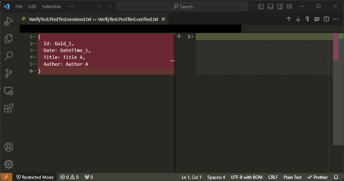
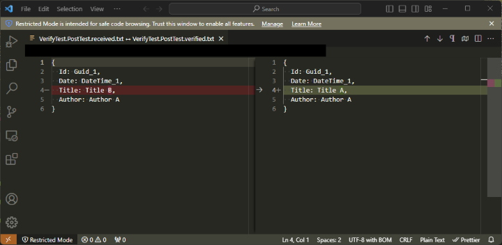
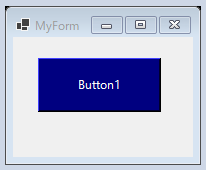
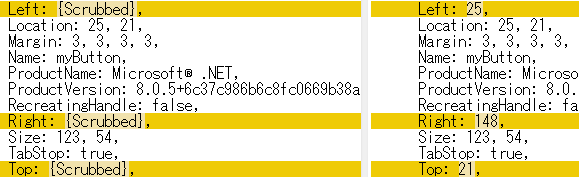
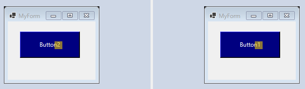
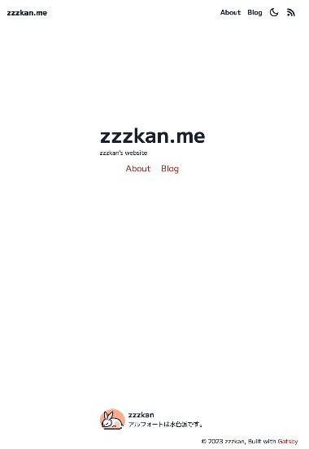

この投稿は[C#アドベントカレンダー 2023](https://qiita.com/advent-calendar/2023/csharplang)（シリーズ 2）の 25 日目 🎄 の記事です。C#でスナップショットテストを簡単に始められるライブラリ[VerifyTests/Verify](https://github.com/VerifyTests/Verify)について紹介します。

（2024-05-19 更新）UI や PDF に関する内容をより詳細なものに更新しました。

## スナップショットテストとは

スナップショットテストとは、ある時点のプログラムの出力をスナップショットとして保存しておき現在の出力と比較することで、予期せぬ変更が起こっていないか検証するテスト手法のことです。

（現在のところ）スナップショットテストと検索すると[Jest のスナップショットテスト](https://jestjs.io/ja/docs/snapshot-testing)が最初のほうにヒットしますが、ここでは以下のように UI コンポーネントに対するテストとしてとても有効な手法として紹介されています。

> A typical snapshot test case renders a UI component, takes a snapshot, then compares it to a reference snapshot file stored alongside the test.

もちろん UI コンポーネントに対して有効なテスト手法なのですが、別に UI コンポーネントだけのテストってわけではなく、複雑なオブジェクトに対するリグレッションテストとして使い勝手がよいと思います。

また、UI 関連のテストとして似たテストに Visual Regression Testing があります。これはスナップショットを、シリアライズしたテキストではなく、スクリーンショットなどの画像として保存しておいて比較するテスト手法のことです。Jest の紹介では [Snapthot Testing と Visual Regression Testing は区別している](https://jestjs.io/ja/docs/snapshot-testing#%E3%82%B9%E3%83%8A%E3%83%83%E3%83%97%E3%82%B7%E3%83%A7%E3%83%83%E3%83%88%E3%83%86%E3%82%B9%E3%83%88%E3%81%A8%E3%83%93%E3%82%B8%E3%83%A5%E3%82%A2%E3%83%AB%E3%81%AE%E5%9B%9E%E5%B8%B0%E3%83%86%E3%82%B9%E3%83%88%E3%81%AE%E9%81%95%E3%81%84%E3%81%AF%E4%BD%95%E3%81%A7%E3%81%99%E3%81%8B)んですが、どちらもある時点のスナップショットを作成しているという点は共通しているので、ここではどちらもスナップショットテストと呼ばせてもらことにします。

このスナップショットテストは非常に強力なテスト手法なのですが、スナップショットの作成、管理、比較などやることがたくさんあり独自で実装するのは骨が折れます。こういう処理はライブラリに任せたいものです。

## そこで Verify ですよ

そこで登場するのがスナップショットテストライブラリである[VerifyTests/Verify](https://github.com/VerifyTests/Verify)です。

この Verify ですが、スナップショットテストに必要な基本的な機能はもれなく抑えているとても便利なライブラリです。xUnit などのテストフレームワークを組み合わせて使うのですが、以下のように C#で使われるたいていのテストフレームワークに対応しています。

- [Verify.NUnit](https://nuget.org/packages/Verify.NUnit/)
- [Verify.Xunit](https://nuget.org/packages/Verify.Xunit/)
- [Verify.Fixie](https://nuget.org/packages/Verify.Fixie/)
- [Verify.Expecto](https://nuget.org/packages/Verify.Expecto/)
- [Verify.MSTest](https://nuget.org/packages/Verify.MSTest/)

ライセンスは MIT で、2023 年 9 月に AWS の FOSS fund にも選ばれています。

## オブジェクトをテストする

とりあえず検証用に以下のクラスを用意してみました。

```cs
public class Post(string title, string author)
{
    public Guid Id { get; } = Guid.NewGuid();
    public DateTime Date { get; } = DateTime.Now;
    public string Title { get; } = title;
    public string Author { get; } = author;
}
```

この`Post{:txt}`に対して Verify でスナップショットテストを書くと以下のようになります。今回は Xunit をベースに使ってみます。

```cs
[Fact]
public Task PostTest()
{
    var post = new Post("Title A", "Author A");
    return Verify(post);
}
```

スナップショットを取りたい対象を引数に`Verify(){:txt}`を呼び出すだけです。非常にシンプルですね。このテストを実行すると、初回は`*.verified.txt{:txt}`と`*.received.txt{:txt}`の 2 つのファイルが生成されます。`*.verified.txt{:txt}`が正解とするスナップショットで、`*.received.txt{:txt}`が実際にいま生成されたスナップショットです。

初回は正解のスナップショットがないはずなのでテストは必ず失敗して以下のような画面が出てきます。



この Verify ですが親切に[DiffEngine](https://github.com/VerifyTests/DiffEngine)というものを用意してくれていて、**スナップショットに差がある場合はその場で差分表示してくれ**ます。おかげで簡単に差分を確認しながら現在のスナップショットを採用するか否か判断できます。今回の場合は、`*.received.txt{:txt}`（左側）が期待通りの出力なので`*.verified.txt{:txt}`（右側）へマージします。

ちなみに、この DiffEngine で使用されるツールはある程度自分で選択できます。上記の画像では Visual Studio Code が使用されていましたが、たとえば Visual Studio で差分を確認したい場合は以下のようにします。

```cs
DiffTools.UseOrder(DiffTool.VisualStudio);
```

ほかにも WinMerge や Vim などいくつかのツールが選択できます。選択可能なツールや優先度など詳細は[diff-tool.order.md](https://github.com/VerifyTests/DiffEngine/blob/main/docs/diff-tool.order.md)を見てみてください。また、この DiffEngine は CI サーバー上などでは起動したくないと思います。そのような場合は、環境変数`DiffEngine_Disabled{:txt}`を`true{:txt}`に設定するか、`DiffRunner.Disabled = true;{:cs}`とすることで無効化できます。

次に`Post{:txt}`のタイトルを変更してみます。

```cs
[Fact]
public Task PostTest()
{
    var post = new Post("Title B", "Author A");
    return Verify(post);
}
```

この状態でテスト実行すると以下のような差分が得られます。



期待通りタイトルに差分があることが確認できます。そしてもう 1 つ、**あえてメンバーに含めていた`Guid{:txt}`と`DateTime{:txt}`の差分がない**ことも注目です。これは Verify がよしなに値を置き換えてくれているおかげです。こういうのありがたいですね～。

## UI をテストする

ここからは UI のスナップショットテストをやってみます。今回は Windows Forms で試してみます。以下のようなフォームを用意してみました。



### テキストで比較する

これまで通りテストを書くと以下のようになります。

```cs
[Fact]
public Task FormTest()
{
    var post = new MyForm();
    return Verify(post);
}
```

スナップショットは以下のような`Form{:txt}`をシリアライズしたテキストになります。

```txt
{
  AllowTransparency: false,
  AutoScaleBaseSize: 6, 16,
  AutoScroll: false,
  AutoSize: false,
  AutoValidate: EnablePreventFocusChange,
  BackColor: Control,
...
}
```

ただこの中身には Top プロパティのような容易に変化してしまう値も含まれていてこのままではテストになりません。こういときはあらかじめ指定したメンバーを適当な値に置き換え（Scrub）てしまいます。

```cs
[Fact]
public Task FormTest()
{
    var post = new MyForm();
    return Verify(post).ScrubMembers<Control>(
        _ => _.Top,
        _ => _.Left,
        _ => _.Right,
        _ => _.Bottom,
        _ => _.Bounds,
        _ => _.AccessibilityObject
        );
}
```

こうするとスナップショットは以下のように変化します。



指定したメンバーのシリアライズ結果が`{Scrubbed}{:txt}`に置き換わっていることが分かります。`Guid{:txt}`や`DateTime{:txt}`と同じ仕組みですね。ちなみに以下のようにしておけば、グローバルに設定を効かせることもできます。

```cs
VerifierSettings.ScrubMembers<Control>(
    _ => _.Top,
    _ => _.Left,
    _ => _.Right,
    _ => _.Bottom,
    _ => _.Bounds,
    _ => _.AccessibilityObject
    );
```

こんな感じのシリアライザー設定は他にもいろいろあって詳細は[serializer-settings.md](https://github.com/VerifyTests/Verify/blob/main/docs/serializer-settings.md)を見てみてください。

この状態でたとえばボタン名が変化してしまった場合は以下のように差分を検知できます。


### 描画結果で比較する

もう１つ別のアプローチがあってそれが描画結果を比較するという方法です。Verify はこういうことが簡単にできるよう拡張が用意されていて、今回の場合は[Verify.WinForms](https://github.com/VerifyTests/Verify.WinForms)を使用します（ちなみに[Verify.Xaml](https://github.com/VerifyTests/Verify.Xaml)などその他の UI フレームワーク向けの拡張も準備されていたりします）。

Verify.WinForms を使用する場合テストは以下のように書きます。

```cs
[ModuleInitializer]
internal static void Init()
{
    VerifyWinForms.Initialize();
}

[Fact]
public Task FormTest()
{
    var post = new MyForm();
    return Verify(post);
}
```

VerifyWinForms の初期化呼び出しが増えただけですね。これは内部的には`Form{:txt}`や`Control{:txt}`などに対して[Converter](https://github.com/VerifyTests/Verify/blob/main/docs/converter.md)というものを設定していて、スナップショットが画像として得られるようにしています。



ただこのままではよくなくて、デフォルトではスナップショットがテキストではない場合、単純なバイナリ比較をするためわずかな差分があるだけでテストに失敗してしまいます。

そこで[Comparer](https://github.com/VerifyTests/Verify/blob/main/docs/comparer.md)と呼ばれているスナップショット比較器をテストに合うものに変更します。でこういのもすでに色々拡張が用意されていて、今回は画像比較をしたいので[Verify.ImageMagick](https://github.com/VerifyTests/Verify.ImageMagick)を使用してみます。

```cs
[ModuleInitializer]
internal static void Init()
{
    VerifyWinForms.Initialize();
    VerifyImageMagick.Initialize();
    VerifyImageMagick.RegisterComparers();
}

[Fact]
public Task FormTest()
{
    var post = new MyForm();
    return Verify(post);
}
```

`RegisterComparers(){:cs}`が Comparer を登録する処理です。ここでは以下のようにしきい値やメトリクスの設定もできます。

```cs
// デフォルトはthresholdが0.05、metricはFuzz
VerifyImageMagick.RegisterComparers(threshold: 0.01, metric: ImageMagick.ErrorMetric.RootMeanSquared);
```

特にしきい値は高すぎると差分を見逃してしまうのでテスト対象ごとにいい塩梅を見つける必要があります。

また 1 つ注意が必要なのが、テキストの場合とは異なり、 Verify による比較結果の判定と DiffTool による比較結果の判定が必ずしも一致しなくなります。たとえば Verify の判定は差分ありだったけど、DiffTool 上では差分なしと表示されるなんてことがあったりします。（ただこれはいまのところはどうしようもないのかなと思っています。）

### 画像ファイルで比較する

VerifyWinForms を使用すると簡単にフォームを画像化してスナップショットテストを実行できましたが、この画像は[Control.DrawToBitmap(...)](https://learn.microsoft.com/ja-jp/dotnet/api/system.windows.forms.control.drawtobitmap)で生成されるため、必ずしも実際のアプリケーションの描画と一致しなかったりします。

こういった場合を含め、画像の取得は別の手段で行いたいという場合があると思います。Verify はファイルを指定してのスナップショットテストの実行もできるので便利です。

```cs
[ModuleInitializer]
internal static void Init()
{
    VerifyImageMagick.Initialize();
    VerifyImageMagick.RegisterComparers();
}

[Fact]
public Task FormTest()
{
    var path = Screenshot();
    return VerifyFile(path);
}
```

## 帳票（PDF ファイル）をテストする

最後に PDF のスナップショットテストをやってみます。今回はこのサイトのホームページを PDF として印刷したものを使用してみます。Verify には[Verify.Aspose](https://github.com/VerifyTests/Verify.Aspose)など PDF を扱える拡張がいくつか存在しているのですが、商用ライセンスが必要なものが多いんですよね。今回はフリーで利用可能なものを使ってみます。

### 画像にしてから比較する

実は先ほど登場した Verify.ImageMagick には PDF を画像に変換する Converter が用意されています。のでこれを使うだけです。ただし、**事前に[Ghostscript](https://www.ghostscript.com/)をインストールしておく**必要があります。Ghostscript は AGPL 版があるのでこれが使えれば無償です。

```cs
[ModuleInitializer]
internal static void Init()
{
    VerifyImageMagick.Initialize();
    VerifyImageMagick.RegisterComparers();
    VerifyImageMagick.RegisterPdfToPngConverter();
}

[Fact]
public Task FormTest()
{
    return VerifyFile("report.pdf").ImageMagickBackground(MagickColors.White);;
}
```

`RegisterPdfToPngConverter(){:cs}`がその Converter を登録する処理です。でスナップショットは以下のような画像になります。



ちなみに`ImageMagickBackground(...){:cs}`は背景が透明な領域を塗りつぶす処理です。必要に応じて呼び出すといいです。

### テキストを抽出してから比較する

[Verify.PdfPig](https://github.com/VerifyTests/Verify.PdfPig)を使用すると PDF からテキストを抽出したうえでスナップショットテストを実行できます。

```cs
[ModuleInitializer]
internal static void Init()
{
    VerifyPdfPig.Initialize();
}

[Fact]
public Task FormTest()
{
    return VerifyFile("report.pdf");
}
```

スナップショットは以下のようなテキストになります。

```txt
{
  Information: {
    Creator: Mozilla/5.0 (Windows NT 10.0; Win64; x64) AppleWebKit/537.36 (KHTML, like Gecko) Chrome/124.0.0.0 Safari/537.36 Edg/124.0.0.0,
    Producer: Skia/PDF m124,
    Title: Home - zzzkan.me,
    CreationDate: DateTimeOffset_1,
    ModifiedDate: DateTimeOffset_1
  },
  Pages: [
    {
      Text:
zzzkan.me

zzzkan's website

About Blog

zzzkan
アルフォートは水色派です。

© 2023 zzzkan, Built with Gatsby
zzzkan.me About Blog

    }
  ]
}
```

これは[PdfPig](https://github.com/UglyToad/PdfPig)というライブラリを使用しているようです（ライセンスは Apache-2.0 license）。テスト対象に応じて画像比較するかテキスト比較するか使い分けられそうで良いですね。

## おわりに

ということで今回はスナップショットテストライブラリである Verify を紹介してきました。とても便利なライブラリな割に日本語情報がなかなか見つからなかったのでいろいろ書いてみました。

スナップショットテストは、 Verify のようなライブラリを使えば簡単にテストを始められるがとても良いなと思っています。一方で、最初のスナップショットの妥当性は人の目で確認する必要があるし、差分が発生した場合も最終的には人の目で確認する必要があるので、やりすぎも注意だなとも思います。
