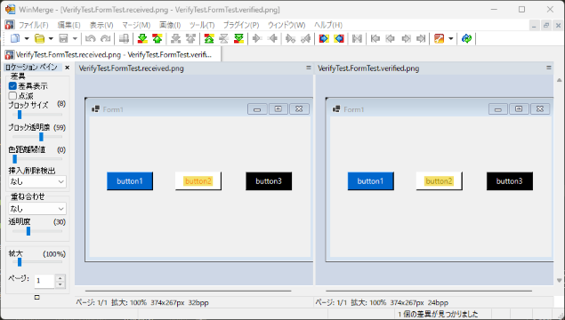

この投稿は[C#アドベントカレンダー 2023](https://qiita.com/advent-calendar/2023/csharplang)（シリーズ 2）の 25 日目 🎄 の記事です。C#でスナップショットテストを簡単に始められるライブラリ[VerifyTests/Verify](https://github.com/VerifyTests/Verify)について紹介します。

## スナップショットテストとは

スナップショットテストとは、ある時点のプログラムの出力をスナップショットとして保存しておき現在の出力と比較することで、予期せぬ変更が起こっていないか検証するテスト手法のことです。

（現在のところ）スナップショットテストと検索すると[Jest のスナップショットテスト](https://jestjs.io/ja/docs/snapshot-testing)が最初のほうにヒットしますが、ここでは以下のように UI コンポーネントに対するテストとしてとても有効な手法として紹介されています。

> A typical snapshot test case renders a UI component, takes a snapshot, then compares it to a reference snapshot file stored alongside the test.

もちろん UI コンポーネントに対して有効なテスト手法なのですが、別に UI コンポーネントだけのテストってわけではなく、
どうしても複雑になってしまうオブジェクトに対するリグレッションテストとして使い勝手がよいと思います。

また、UI 関連のテストとして似たようなテストに Visual Regression Testing があります。これはスナップショットを、シリアライズしたテキストではなく、スクリーンショットなどの画像として保存しておいて比較するテスト手法のことです。Jest の紹介では [Snapthot Testing と Visual Regression Testing は区別している](https://jestjs.io/ja/docs/snapshot-testing#%E3%82%B9%E3%83%8A%E3%83%83%E3%83%97%E3%82%B7%E3%83%A7%E3%83%83%E3%83%88%E3%83%86%E3%82%B9%E3%83%88%E3%81%A8%E3%83%93%E3%82%B8%E3%83%A5%E3%82%A2%E3%83%AB%E3%81%AE%E5%9B%9E%E5%B8%B0%E3%83%86%E3%82%B9%E3%83%88%E3%81%AE%E9%81%95%E3%81%84%E3%81%AF%E4%BD%95%E3%81%A7%E3%81%99%E3%81%8B)んですが、どちらもある時点のスナップショットを作成しているという点は共通しているので、ここではどちらもスナップショットテストと呼ばせてもらことにします。

このスナップショットテストは非常に強力なテスト手法なのですが、スナップショットの作成、管理、比較などやることがたくさんあり独自で実装するのは骨が折れます。こういう処理はライブラリに任せたいものです。

## そこで Verify ですよ

そこで登場するのがスナップショットテストライブラリである[VerifyTests/Verify](https://github.com/VerifyTests/Verify)です。

この Verify ですが、スナップショットテストに必要な基本的な機能はもれなく抑えているとても便利なライブラリです。xUnit などのテストフレームワークを組み合わせて使うのですが、以下のように C#で使われるたいていのフレームワークに対応しています。

- [Verify.NUnit](https://nuget.org/packages/Verify.NUnit/)
- [Verify.Xunit](https://nuget.org/packages/Verify.Xunit/)
- [Verify.Fixie](https://nuget.org/packages/Verify.Fixie/)
- [Verify.Expecto](https://nuget.org/packages/Verify.Expecto/)
- [Verify.MSTest](https://nuget.org/packages/Verify.MSTest/)

スターも（現在のところ）2.2k ついていて NuGet 関連のレポジトリではかなりついているほうではないでしょうか。また、2023 年 9 月に AWS の FOSS fund にも選ばれています。ちなみにライセンスは MIT です。

## 実際に使ってみる

それでは実際に使ってみます。今回は Xunit をベースに使ってみます。

### オブジェクトをテストする

とりあえず検証用に以下のクラスを用意してみました。

```cs
public class Post(string title, string author)
{
    public Guid Id { get; } = Guid.NewGuid();
    public DateTime Date { get; } = DateTime.Now;
    public string Title { get; } = title;
    public string Author { get; } = author;
}
```

この`Post{:txt}`に対して Verify でスナップショットテストを書くと以下のようになります。

```cs
[Fact]
public Task PostTest()
{
    var post = new Post("Title A", "Author A");
    return Verify(post);
}
```

スナップショットを取りたい対象を引数に`Verify(){:txt}`を呼び出すだけです。非常にシンプルですね。このテストを実行すると、初回は`*.verified.txt{:txt}`と`*.received.txt{:txt}`の 2 つのファイルが生成されます。`*.verified.txt{:txt}`が正解とするスナップショットで、`*.received.txt{:txt}`が実際にいま生成されたスナップショットです。

初回は正解のスナップショットがないはずなのでテストは必ず失敗して以下のような画面が出てきます。


そうなんです。この Verify 親切にも[DiffEngine](https://github.com/VerifyTests/DiffEngine)というものを用意してくれていて、**スナップショットに差がある場合はその場で差分表示してくれる**んです。おかげで簡単に差分を確認しながら現在のスナップショットを採用するか否か判断できます。今回の場合は、`*.received.txt{:txt}`（左側）が期待通りの出力なので`*.verified.txt{:txt}`（右側）へマージします。

ちなみに、この DiffEngine で使用されるツールはある程度自分で選択できます。上記の画像では Visual Studio Code が使用されていましたが、たとえば Visual Studio で差分を確認したい場合は以下のようにします。

```cs
DiffTools.UseOrder(DiffTool.VisualStudio);
```

ほかにも WinMerge や Vim などいくつかのツールが選択できます。選択可能なツールや優先度など詳細は[diff-tool.order.md](https://github.com/VerifyTests/DiffEngine/blob/main/docs/diff-tool.order.md)を見てみてください。また、この DiffEngine は CI サーバー上などでは起動したくないと思います。そのような場合は、環境変数`DiffEngine_Disabled{:txt}`を`true{:txt}`に設定するか、`DiffRunner.Disabled = true;{:cs}`とすることで無効化できます。

さて、次に`Post{:txt}`のタイトルを変更してみます。

```cs
[Fact]
public Task PostTest()
{
    var post = new Post("Title B", "Author A");
    return Verify(post);
}
```

この状態でテスト実行すると以下のような差分が得られます。


期待通りタイトルに差分があることが確認できます。そしてもう 1 つ、**あえてメンバーに含めていた`Guid{:txt}`と`DateTime{:txt}`の差分がない**ことも注目です。これは Verify がよしなにサニタイズしてくれているおかげです。こういうのありがたいですね～。

### UI をテストする

ここからは画面のスナップショットテストをやってみます。Verify なんですが拡張として、たとえば [Verify.Blazor](https://github.com/VerifyTests/Verify.Blazor)や[Verify.Xaml](https://github.com/VerifyTests/Verify.Xaml)、はたまた[Verify.WinForms](https://github.com/VerifyTests/Verify.WinForms)などが用意されていて、UI ベースのスナップショットテストも簡単に始められるようになっています。

今回は（あえて？） Windows Forms を試してみようと思います。ここでは以下のようなフォーム（`MyForm{:txt}`）を用意して、Button2 の文字色を赤に変更することを考えます。


Verify.WinForms を使用するとテストは以下のように書けます。

```cs
[Fact]
public Task FormTest()
{
    VerifyWinForms.Initialize();
    var post = new MyForm();
    return Verify(post);
}
```

これを実行すると画像のスナップショットが得られ、その差分は以下のようになります。



簡単に UI ベースのスナップショットテストが実行できました。ただし、画像比較する場合は Comparer（スナップショットの比較方法）に注意が必要そうです。デフォルトでは単なるバイナリ比較なので、差分なしと判定して欲しい状態であっても差分ありと判定されてしまいます。このままでは非常に不安定なテストになってしまうので、**テスト対象に合わせて Comparer を変更する**必要があります。

Comparer の変更方法は[comparer.md](https://github.com/VerifyTests/Verify/blob/main/docs/comparer.md)を参照してください。たとえば、[Verify.ImageMagick](https://github.com/VerifyTests/Verify.ImageMagick)など準備された Comparer もいくつか存在しているので自分に合うものを選ぶとよいと思います。ちなみに、Verify.ImageMagick はたとえば以下のようにして比較方法を設定できます。

```cs
// しきい値やエラーメトリクスを変更できる
VerifyImageMagick.RegisterComparers(threshold: 0.1, metric: ImageMagick.ErrorMetric.PerceptualHash);
```

### 帳票（PDF）をテストする

C#で作られている業務系のシステムでは帳票出すものも結構多いのではないでしょうか。（ここでは詳しい使い方は省略しますが）Verify には[Verify.Aspose](https://github.com/VerifyTests/Verify.Aspose)など PDF を扱うための拡張も存在しています。

また、PDF を 1 ページごとの画像に変換してから画像によるスナップショットテストを行うという方法も考えられます。Verify には、このような一度変換処理をかませてからスナップショットテストしたい場合のために Converters という仕組みが用意されています。詳細は[converter.md](https://github.com/VerifyTests/Verify/blob/main/docs/converter.md)を見てみてください。

ちなみに 上述した Verify.ImageMagick は以下で PDF→PNG の Converters を準備してくれているようです。

```cs
VerifyImageMagick.RegisterPdfToPngConverter();
```

（Ghostscript を使ってると思うので）ライセンス等注意が必要だとは思いますがこちらも有力な候補になると思います。作者の方も商用ライセンスなしで PDF をテストする方法として[Verify.ImageMagick を紹介してたり](https://github.com/VerifyTests/Verify/issues/507#issuecomment-1083721736)します。

## おわりに

今回はスナップショットテストライブラリである Verify の紹介をしました。

スナップショットテストは、 Verify のようなライブラリを使えば簡単にテストを始められるのがとても魅力的だと思っています。ただ、最初のスナップショットの妥当性は人の目で確認する必要があるし、差分が発生した場合も人の目で確認してマージする必要があるので、やりすぎ注意な面はあるなあと思ってます。
