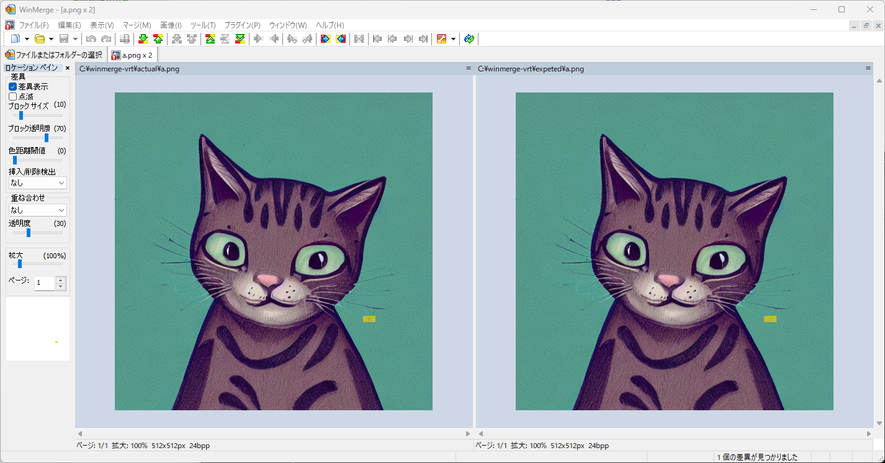
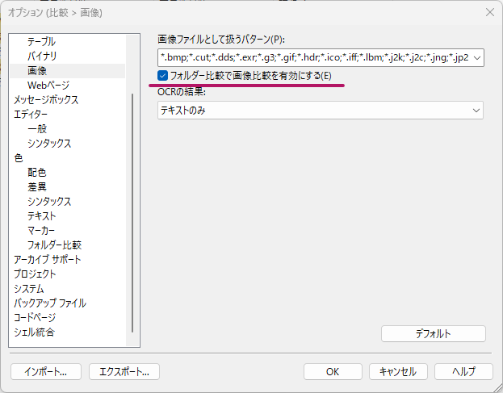
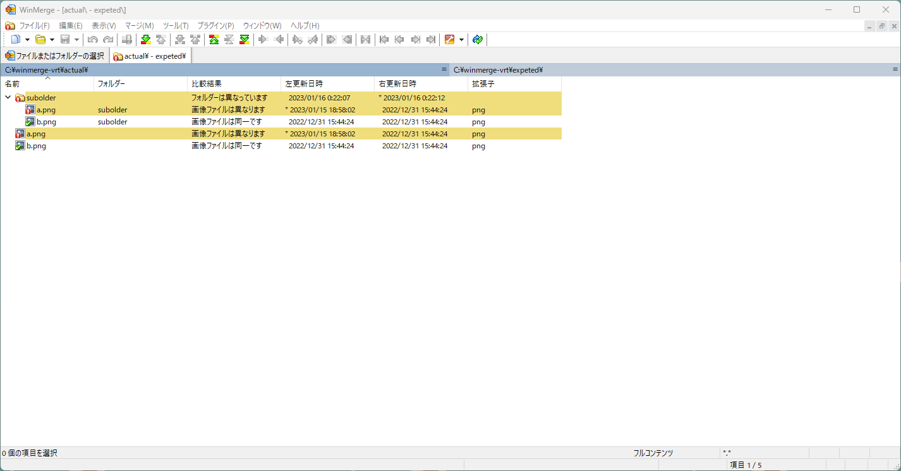
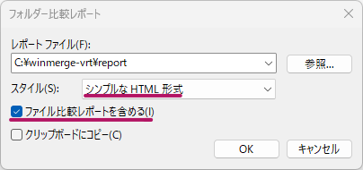
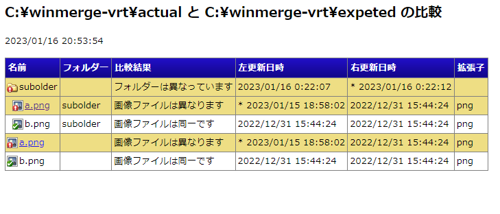
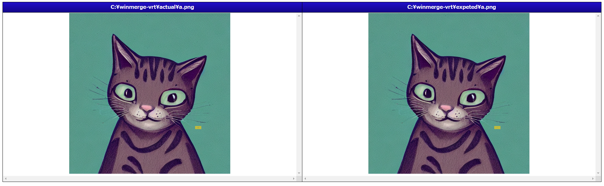

ここ最近 Visual Regression Testing（VRT）というものが Web フロントエンド周辺で普及しつつあるようです。実はこのブログのために作成した [Gatsby Theme](https://github.com/zzzkan/gatsby-theme-blog) の CI でも簡単にですが Playwright による VRT を実行してみたりしてます。

## Visual Regression Testing（VRT） とは

いわゆる回帰テストの 1 種で、過去と現在のアプリケーション画面の画像を比較し意図しない変更がないか確認するテスト手法のことです。アプリケーション画面の比較を目視で行うのはどうしても限界があるため VRT をサポートするツールは機械的に画像を比較する仕組みを持っています。

## 導入の選択肢

VRT 導入の選択肢ですがたとえば以下の記事にもあるようにいろいろあります。

[2023 年に Visual Regression Testing を始めるならどんな選択肢があるか](https://zenn.dev/loglass/articles/visual-regression-testing-comparison)

ただ、Web フロントエンド周辺で普及しているようなので当たり前なのですがブラウザを前提にしたものが多く、Web フロントエンド以外のプロジェクトでの導入がためらわれるものも多そうです。[reg-suit](https://github.com/reg-viz/reg-suit)なんかは機能がシンプル（画像の差分検出だけ）で Web フロントエンド以外のプロジェクトでも導入しやすそうなのですが、Node.js や依存関係のインストールはやはり必要です。

許可されていないソフトウェアはインストールできねえ…という悲しい声が聞こえてきた気がします。

## WinMerge の出番

何らからの事情で VRT として作りこまれているツールを安易に使えない場面も考えられます。このような環境であっても高確率で初期装備されているソフトウェアの 1 つに[WinMerge](https://github.com/winmerge/winmerge)があると思っています。この WinMerge 実は画像比較もいけます。ということで WinMerge で VRT っぽいことができないか試してみます。

なおここでは WinMerge v2.16.24.0 を用いました。また、画像比較とレポート生成のみを扱い比較画像の生成については扱いません。

### 画像比較

WinMerge での画像比較は単純に画像ファイルを WinMerge で開くだけです。すると以下のような比較結果が得られます。



差分がある部分はハイライト表示されておりわかりやすいですね。もちろフォルダーごと比較も可能です。比較前に\[編集\] > \[設定\] > \[比較\] > \[画像\]で「フォルダー比較で画像比較を有効にする」にチェックを入れておく必要があります。



比較対象のフォルダーを WinMerge で開き比較すると以下のような比較結果が得られます。



フォルダー比較であっても各ファイルに対して画像比較が動作していることがわかります。期待結果の画像を保存したフォルダーと現行結果の画像を保存したフォルダーを用意しておけば WinMerge で VRT の肝である機械的な画像比較を実現できそうです。

### 比較結果のレポート生成

VRT をサポートしているツールはたいていテストレポート結果の出力機能がついています。レポート結果をまとめて残せると何かと便利です。

実は WinMerge はレポートの出力が可能です。ここではフォルダー比較した結果をレポート出力することにします。比較結果が出力された状態で\[ツール\] > \[レポートの生成\]を選択します。すると以下のようダイアログが表示されます。



レポートスタイルには「シンプルな HTML 形式」を選択し「ファイル比較レポートを含める」にチェックを入れておきます。すると以下のようなレポートが出力されます。



またファイル間の比較レポートを見ることもできます。



必要十分な情報がまとまっていますね。

### コマンドライン実行

いままでは WinMerge 画面上でさまざまな操作をしてきました。ただ VRT を実行する場合画面操作は不要でコマンドラインから実行できるほうが便利です。

実は WinMerge はコマンドラインからの実行も可能です。さらに、オプションを指定することでこれまで行ってきたような設定を渡すことができます。「画像が含まれる 2 つのフォルダーを比較し結果をレポートに出力する」には以下のようにします。

```bat
"C:\Users\user\AppData\Local\Programs\WinMerge\WinMergeU.exe" .\expected .\actual /r /u /noprefs /cfg Settings/DirViewExpandSubdirs=1 /cfg Settings/EnableImageCompareInFolderCompare=1 /cfg ReportFiles/ReportType=2 /cfg ReportFiles/IncludeFileCmpReport=1 /minimize /noninteractive /or report.html
```

`WinMergeU.exe`は WinMerge のパス、`expected`と`actual`は比較対象、以降がオプションで使用しているのは以下です。

| オプション        | 内容                                                                   |
| ----------------- | ---------------------------------------------------------------------- |
| `/r`              | サブフォルダー内のすべてのファイルを比較(再帰比較)                     |
| `/u`              | パスを最近使用した項目リストに追加しない                               |
| `/noprefs`        | デフォルト設定を使用する（レジストリに保存している設定を読み込まない） |
| `/cfg config`     | 設定情報を指定する                                                     |
| `/minimize`       | 最小化状態で WinMerge を開始                                           |
| `/noninteractive` | 比較やレポート出力後に WinMerge を終了                                 |
| `/or reportpath`  | レポート出力パスを指定する                                             |

`/cfg`で渡している設定情報は以下のような内容です。

| 設定情報                                       | 内容                                                                                                             |
| ---------------------------------------------- | ---------------------------------------------------------------------------------------------------------------- |
| `Settings/DirViewExpandSubdirs=1`              | 「自動的にサブフォルダーを展開する」を有効化（展開しておかないとレポートでファイル単位の比較結果を確認できない） |
| `Settings/EnableImageCompareInFolderCompare=1` | 「フォルダー比較で画像比較を有効にする」を有効化                                                                 |
| `ReportFiles/ReportType=2`                     | レポートスタイルとして「シンプルな HTML 形式」を選択                                                             |
| `ReportFiles/IncludeFileCmpReport=1`           | 「ファイル比較レポートを含める」を有効化                                                                         |

コマンド１発で画像比較からレポートの作成までできるようになりました。正直なところここまでできるとは思ってませんでした。バッチファイルなんかをしっかり書けばかなり便利になりそう。

### （追記）簡単なバッチファイル

とりあえず簡単なバッチファイルを書いてみました。

```bat
:: diff-image.cmd

@echo off
setlocal

::WinMergeのパスを設定（適宜修正…）
set winmerge_path="C:\Users\user\AppData\Local\Programs\WinMerge\WinMergeU.exe"

if "%1"=="" (
    echo Error : missing required parameter 'expected'
    exit /b 1
)
set expected_path=%~1
shift

if "%1"=="" (
    echo Error : missing required parameter 'actual'
    exit /b 1
)
set actual_path=%~1
shift

:loop
if not "%1"=="" (
    if "%1"=="/r" (
        if "%2"=="" (
            echo Error : missing required parameter 'reportpath'
            exit /b 1
        )
        set report_path=%~2
        shift
    )
    if "%1"=="/u" (
        xcopy /F /S /E /I /Y %actual_path% %expected_path%
        exit /b 0
    )
    shift
    goto :loop
)

set config_parameter=/noprefs /cfg Settings/DirViewExpandSubdirs=1 /cfg Settings/EnableImageCompareInFolderCompare=1 /cfg ReportFiles/ReportType=2 /cfg ReportFiles/IncludeFileCmpReport=1
if not "%report_path%"=="" set report_parameter=/noninteractive /minimize /or %report_path%

%winmerge_path% %expected_path% %actual_path% /r /u /wr %config_parameter% %report_parameter%

exit /b 0
```

使い方は以下です。

```bat
.\diff-image.cmd expected actual [/u] [/r peprtpath]
```

次のオプションが利用できます。オプションが指定されていない場合は WinMerge の比較結果画面を表示します。

- `/u`：`expected`を`actual`で更新する
- `/r peprtpath`：レポートを出力する

できれば`/u`による更新は WinMerge のマージで行えるようにしてみたかったのですがうまく動作させられなかったためあきらめて単純に`xcopy`で上書きしています。

## 参考

- [WinMerge のコマンドラインオプション - Qiita](https://qiita.com/mima_ita/items/ac21c0588080e73fc458)
- [コマンドライン - WinMerge 2.16 ヘルプ](https://manual.winmerge.org/jp/Command_line.html)
