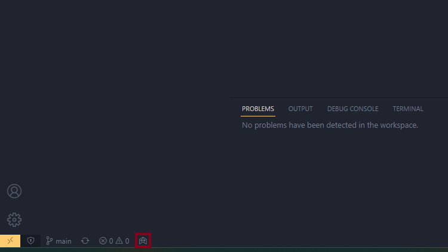
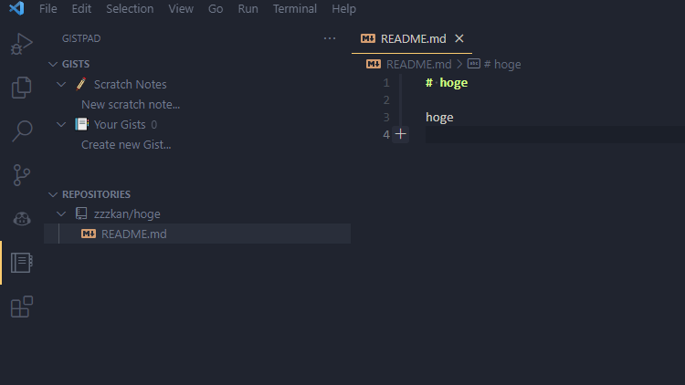

最近 VS Code でドキュメントをよく書きます。拡張機能が充実していて便利です。このドキュメントを Git でバージョン管理している場合、当然ですが Commit したり Push したりと一応気を使う必要があります。いまどきなドキュメント作成アプリはたいていリモートへ自動保存する機能があるので、比較すると少し煩わしさを感じることがありました。

そこで（機会は限定されると思いますが）Commit や Push を自動化できると良いなあと前々から思ってました。ということで調べました。

## Post Commit Command

Commit したら自動的に Push するだけで良いのであれば VS Code の設定だけで可能です。 settings.json に以下を追加します。

```json
{
  "git.postCommitCommand": "push"
}
```

こうすると VS Code 上の Commit ボタンが Commit & Push ボタンになります。ちなみに、postCommitCommand は "push" 以外にも "sync"（Pull & Push）も指定可能です。

## GitDoc

[GitDoc - Visual Studio Marketplace](https://marketplace.visualstudio.com/items?itemName=vsls-contrib.gitdoc)

> GitDoc is a Visual Studio Code extension that allows you to automatically commit/push/pull changes on save.

とあるようにファイル保存時に Commit やら Push やらを自動実行してくれる拡張機能です。完璧に今回やりたかったやつです。

Commit 等の自動実行は GitDoc をインストールだけ…では有効にはならないです（有効になってしまうと手当たり次第 Commit されるので困ります）。インストール後 `GitDoc: Enable{:cmd}` コマンドを実行することで機能が有効となりステータスバーに GitDoc のアイコンが表示されます。



有効/無効は settings.json で管理されています。

```json
{
  "gitdoc.enabled": true
}
```

この設定ですが間違ってもユーザー設定では行わないほうがいいです。VS Code で Git プロジェクトを開くと手当たり次第 Commit されるようになります。ちなみに `GitDoc: Enable{:cmd}` コマンドはワークスペースレベルで機能を有効にしてくれるので安心です。

GitDoc にはいろいろ設定があります。ここでは特に便利そうなものをピックアップしてみます。

### 特定のファイルだけ自動 Commit の対象にする

自動 Commit の対象とするファイルを指定できます。たとえば .md ファイルだけ自動 Commit の対象にしたい場合は settings.json で以下のように記述します。

```json
{
  "gitdoc.filePattern": "**/*.md"
}
```

このように設定しておけばプロジェクト内のドキュメントだけ自動 Commit するなんてことも可能です。便利！デフォルトでは `"**/*"` に設定されているのですべてのファイルが自動 Commit の対象となっています。

### エラーや警告の検出

GitDoc は デフォルトでは VS Code 上でエラーが検出されていない場合のみ自動 Commit を実行します。そのため、たとえば Linter を導入している場合は指摘がなくなるまで Commit を待ってくれます。めちゃ賢い！

ちなみにデフォルトではエラーですが警告でも Commit を抑制したい場合は以下のように設定しておきます。

```json
{
  "gitdoc.commitValidationLevel": "warning"
}
```

### Commit/Push/Pull を実行するタイミング

Commit/Push/Pull を実行するタイミングも細かく指定できます。デフォルトでは以下のような設定になっていて、ファイルが保存されてから 30 秒後に Commit されてその後 Pull その後 Push されます。

```json
{
  "gitdoc.autoCommitDelay": 30000,
  "gitdoc.autPull": "onPush",
  "gitdoc.autoPush": "onCommit"
}
```

こういった痒い所まで設定できるはすごくありがたいですね。

## GistPad

[GistPad - Visual Studio Marketplace](https://marketplace.visualstudio.com/items?itemName=vsls-contrib.gistfs)

今回調べてみようと思ったのは実はこの GistPad の存在を知ったからでした。今気が付きましたが GitDoc と GistPad の作者は一緒の方ですね。すごい。

名前からすると Gist しか扱えなさそうですが GitHub リポジトリも扱うことができます。インストールすると以下のようにアイコンが追加されそこから Gist や GitHub リポジトリを編集できます。



GistPad 上で行った変更は自動的に GitHub と同期されるので Commit やら Push やら気にする必要がないです。さらに、GistPad は開いているプロジェクトとは独立しているので、どのプロジェクトが開かれていてもすぐに Gist や紐づけておいたリポジトリにアクセスできます。

VS Code を保存先が Gist や（メモ専用の）リポジトリのメモ帳代わりにしたい場合は非常に便利だと思います。ただ、開いているプロジェクトの影響を受ける可能性がある（たとえば .vscode/settings.json とか）のでこの点は気をつけたほうがいいかもしれません。

## 参考

- [git - Visual Studio Code push automatically - Stack Overflow](https://stackoverflow.com/questions/34719129/visual-studio-code-push-automatically)
- [GistPad 雑録](https://zenn.dev/voluntas/scraps/7721c58680931b)
