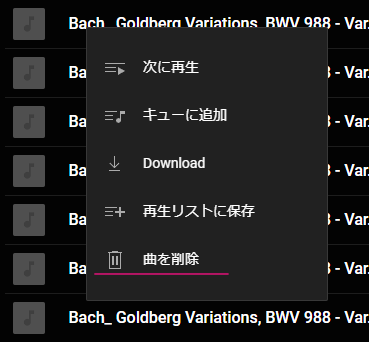
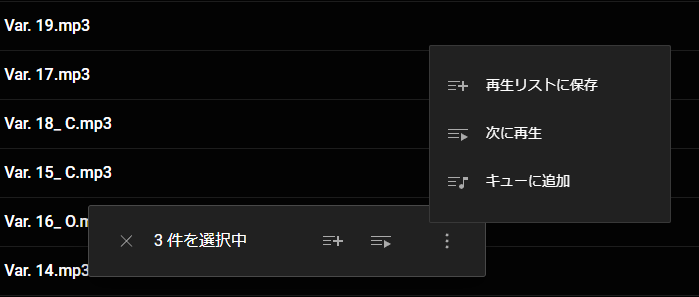

Youtube Music は Spotify のような音楽配信サービスですが、じつは自分が所有している[音楽のアップロード](https://support.google.com/youtubemusic/answer/9716522?hl=ja)にも対応しています。しかも無料です。

この機能は先代の Google Play Music の頃からあってありがたく利用させてもらっていたのですが、Google Play Music が 2020 年にサービスが終了したため、私がアップロードしていた楽曲はすべて Youtube Music へ移行していました。

最近ちょっと事情があって別アカウントに楽曲を移動させたくて、アップロードした楽曲も一度一括削除したいと思っていたのですが、少し面倒だったので忘備録です。

## ブラウザからは個別削除しか方法がないよう

Youtube Music をブラウザで開いてアップロードした楽曲を選択すれば以下のメニューが表示され楽曲の削除はできます。

ただアップロードしている楽曲はかなりの量なので個別に削除し続けるというはちょっとやる気起きません。

で全選択したらいいじゃないとなるのですが Youtube Music にはそういった機能はないようですし、さらにそもそも楽曲を複数選択する機能はあるものの、残念ながらメニューから「削除」が消えてしまいます。

（ちゃんと覚えていないのですが）Google Play Music ではできたような気がするので悲しい。まあ一応以前[Amazon プライムビデオの視聴履歴を一括削除](/blog/delete-history-prime-video/)したときのように Playwright 等で自動化する方法もありますが、今回はそこまでやる気がないのでやめました。

## API を使う？

で API があったりしないのかなと思って調べてみると、ちょうど[ytmusicapi](https://github.com/sigma67/ytmusicapi)という Python ライブラリがあって、[`YTMusic.delete_upload_entity(entityId: str){:py}`](https://ytmusicapi.readthedocs.io/en/stable/reference.html#ytmusicapi.YTMusic.delete_upload_entity)を呼び出せばアップロードした楽曲を削除きるようでした。

ただしこれは Google が提供しているものではなく非公式な API になります。

## ytmusic-deleter

ytmusicapi を使えば楽曲を削除できそうだったのでコード書いてもよかったのですが、すでに作っている人いそうだなあと思って探してみたらやっぱりありました。

[ytmusic-deleter](https://github.com/apastel/ytmusic-deleter)

この ytmusic-deleter ですが内部的には先ほどの ytmusicapi を使っているようです。今回はこれを使ってアップロードした楽曲を削除しました。Windows であれば GUI が用意されているので以下のように簡単に使えます。

1. [リリース](https://github.com/apastel/ytmusic-deleter/releases)から最新の exe をダウンロード＆インストール
2. ytmusic-deleter を実行
3. "Log In"ボタンから Google アカウントにログイン、アクセス権を付与
4. "Delete All"ボタン等から楽曲を削除

削除が終わったら頻繁に使うものでもないので念のためアクセス権の削除も一緒にやっておくと安心だと思います。[サードパーティ製のアプリとサービス](http://myaccount.google.com/connections)を確認すると"YouTube on TV"へアクセス権が付与されているはずなのでこれを削除しておきます。

## ちなみに：一括エクスポート

ちなみにアップロードした楽曲を一括エクスポートするには[Google Takeout](https://takeout.google.com/)を使うといいです。Google Takeout で"YouTube と YouTube Music"にチェックを入れ、エクスポートするデータとして"音楽のアップロード"を選択すればエクスポート可能です。
