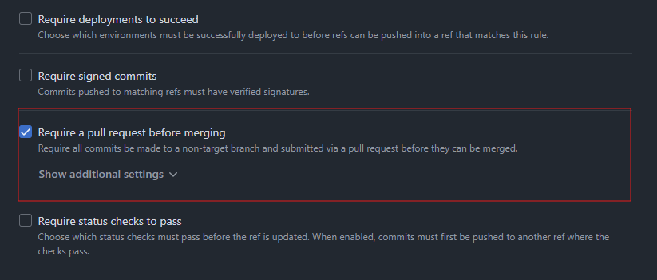
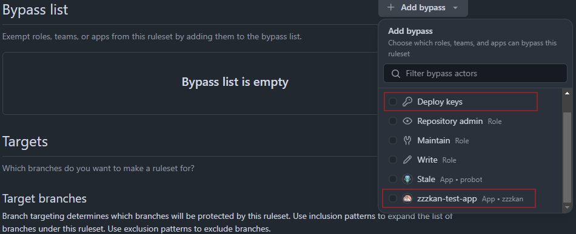
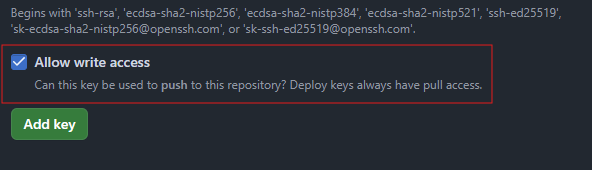

## ブランチ保護

GitHub には、`main{:txt}` などの重要なブランチに対して[保護ルール](https://docs.github.com/ja/repositories/configuring-branches-and-merges-in-your-repository/managing-rulesets/about-rulesets)を設定する機能があります。たとえば、Require a pull request before merging（マージ前に PR を必須にする）とかそういうやつです。



（ちなみにここでは Branch Protection Rules ではなく Repository Rules を想定しています。）

こういうルールは、特にチーム開発をしている場合、うっかりミスを防ぐために設定されていることが多いと思います。

## GitHub Action もルールの影響下にある

たとえば、リリース作業を自動化するため package.json などバージョンを管理しているファイルを更新し `main{:txt}` へ push するような GitHub Action を実行したいとします。このとき保護ルールでマージ前に PR を必須にしていると、

```shell
remote: error: GH013: Repository rule violations found for refs/heads/main.
remote: Review all repository rules at ******
remote:
remote: - Changes must be made through a pull request.
remote:
To ******
 ! [remote rejected] main -> main (push declined due to repository rule violations)
error: failed to push some refs to ******
Error: Process completed with exit code 1.
```

こんな感じでエラーになります。まあ当然といえば当然ですね。

## バイパスすればいい

保護ルール（Repository Rules）では、ルールをバイパスする対象を指定することができます。



ここでは、2024/12 現在残念ながら GitHub Action を指定することはできません。ただ、よくよく見ていくと Repository admin といった Role に加えて、**Deploy Keys** や リポジトリにインストールされている**GitHub App** を指定できることがわかります。こいつらが使えそうです。

### Deploy Key

Deploy Key というのは、

> デプロイ キーは、単一のリポジトリへのアクセス権を付与する SSH キーです。 GitHub は個人アカウントの代わりに、リポジトリに直接キーのパブリックな部分をアタッチし、キーのプライベートな部分はサーバーに残ります。

[デプロイキーの管理 - GitHub Docs](https://docs.github.com/ja/authentication/connecting-to-github-with-ssh/managing-deploy-keys#deploy-keys)

といことで簡単に言えばリポジトリ単位の SSH キーのことです。作り方としては、とりあえず適当にキーペア（公開鍵と秘密鍵）を作ります。

```shell
ssh-keygen -t ed25519 -C ""
```

途中パスフレーズの入力が求められますが、

```shell
Enter passphrase (empty for no passphrase):
```

ここでは**何も設定せずにそのまま Enter で進みます**。（最初パスフレーズ設定してしまって「Permission denied (publickey).」になって軽くはまってしまった。ちなみに、[actions/checkout の issue](https://github.com/actions/checkout/issues/271)とか見てても空でやるしかないはず）

次に公開鍵をリポジトリの Deploy Key に登録します。このとき、今回は Push もしたいので必ず Allow write access にチェックを入れます。これで Deploy Key としての登録は完了です。



次に、今回はこの Deploy Key を GitHub Action で使いたいので、秘密鍵を Actions Secrets に登録します。名前は適当に `DEPLOY_KEY{:txt}` とかでいいんじゃないでしょうか。これで準備は完了です。

あとは以下のような適当なワークフローを書けばおわりです。

```yml
on: workflow_dispatch
permissions:
  contents: write
jobs:
  build:
    runs-on: ubuntu-latest
    steps:
      - uses: actions/checkout@v4
        with:
          fetch-depth: 0
          ref: ${{ github.head_ref }}
          ssh-key: ${{ secrets.DEPLOY_KEY }}
      - run: |
          date > generated.txt
          git config user.name "github-actions[bot]"
          git config user.email "41898282+github-actions[bot]@users.noreply.github.com"
          git add .
          git commit -m "Push with Deploy Keys"
          git push
```

`actions/checkout@v4{:txt}` で `ssh-key{:txt}` を指定して Deploy Key を使うようにしています。バイパスリストに Deploy Keys を追加しておけばちゃんと push されます。


### GitHub Apps

GitHub Apps というのは、

> GitHub Apps は、GitHub の機能を拡張するツールです。 GitHub Apps を使うと、GitHub で、issue を開く、pull request にコメントする、プロジェクトを管理する、といったことを行うことができます。

[GitHub Apps の概要 - GitHub Docs](https://docs.github.com/ja/apps/overview)

ということで、GitHub でなんかいろいろできるやつです。でこの GitHub Apps による認証で GitHub Actions を実行することができます。独自の GitHub Apps を作るのは、そんなに難しくなくて、GitHub アカウントの Settings > Developer Settings > GitHub Apps > New GitHub App から必要な項目を埋めるだけです。

ポイントとしては、

- Homepage URL はリポジトリとか GitHub アカウントとか適当な URL で別にいい
- Webhook URL は Active のチェックボックスを外せば必須ではなくなる
- Permissions は必要最低限の権限を設定しておく（今回は push までするので Contents に Read & Write を設定）

です。

作成すると、引き続き設定画面（General）が表示されるので、AppID と秘密鍵を生成して控えておきます。また、このタイミングで Display information という GitHub App のアイコンを設定する項目が出てくるので好きなアイコンを設定してくのがおすすめ！

次に GitHub App をリポジトリにインストールします。これは設定画面の Install App からできます。

最後にリポジトリに戻って控えておいた AppID と秘密鍵を Actions Secrets に登録します。名前は適当に `APP_ID{:txt}` とか `PRIVATE_KEY{:txt}` とかでいいんじゃないでしょうか。

あとは以下のような適当なワークフローを書けばおわりです。

```yml
on: workflow_dispatch
permissions:
  contents: write
jobs:
  build:
    runs-on: ubuntu-latest
    steps:
      - uses: actions/create-github-app-token@v1
        id: app-token
        with:
          app-id: ${{ secrets.APP_ID }}
          private-key: ${{ secrets.PRIVATE_KEY }}
      - name: Get GitHub App User ID
        id: get-user-id
        run: echo "user-id=$(gh api "/users/${{ steps.app-token.outputs.app-slug }}[bot]" --jq .id)" >> "$GITHUB_OUTPUT"
        env:
          GH_TOKEN: ${{ steps.app-token.outputs.token }}
      - uses: actions/checkout@v4
        with:
          fetch-depth: 0
          token: ${{ steps.app-token.outputs.token }}
          ref: ${{ github.head_ref }}
      - run: |
          date > generated.txt
          git config user.name '${{ steps.app-token.outputs.app-slug }}[bot]'
          git config user.email '${{ steps.get-user-id.outputs.user-id }}+${{ steps.app-token.outputs.app-slug }}[bot]@users.noreply.github.com'
          git add .
          git commit -m "Push with GitHub App"
          git push
```

まず `actions/create-github-app-token@v1{:txt}` でインストールアクセストークンを生成しています。昔はサードパーティーアクションしかなかったみたいで少し使いづらかったようですが、いまなら公式アクションがあります。

次に GitHub App の User ID を取得しています。これは commit 時にメールアドレスに使います。ちなみにこの User ID は `https://api.github.com/users/<app-slug>%5Bbot%5D{:txt}` で確認できます。

あとは生成したトークンを使って checkout したり push したりしています。バイパスリストに GitHub App を追加しておけばちゃんと push されます。


コミットがちゃんと GitHub App によるものなっていてアイコンも設定されていていい感じ！

## まとめ

ということで Deploy Key でも GitHub App でもどちらでも保護ブランチに対して直 push することができました。

どっちがいいのかというところまで考えると、**楽なのは圧倒的に Deploy Key** だと思います。`ssh-keygen{:txt}` して公開鍵と秘密鍵を設定するだけですし。一方で、Deploy Key を作ろうとすると以下のような表示を目にします。

> We recommend using GitHub Apps instead for fine grained control over repositories and enhanced security.

GitHub 的には GitHub Apps を推しているみたいです。GitHub Apps はアクセス権限を細かく柔軟に設定できるのでセキュリティ的に良いはずです。また、Deploy Key はパスフレーズが設定できないはずなので、サーバーが侵害されるとキーに簡単にアクセスされる恐れが一応あります。

あとは各プロジェクトのポリシー次第かなと思います。私は好きなアイコンを設定できるから GitHub App 作るのが良いと思います！！！
