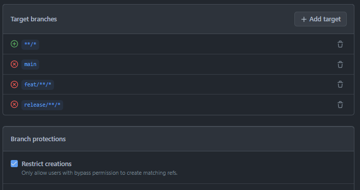
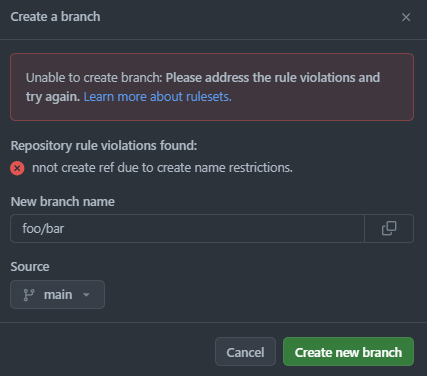

たとえば機能追加の場合は`feat/*{:txt}`のように、ブランチ名に対して命名規則が設けられている場合があります。私はこういう類の規則はすぐに忘れ去る傾向がある（覚えていたくないとも言う）ので、可能な限り仕組みで強制しておいて欲しいと思ってます。

でこれまで GitHub においてブランチに対してルールを設定するなら[Branch Protection Rules（ブランチ保護ルール）](https://docs.github.com/ja/repositories/configuring-branches-and-merges-in-your-repository/managing-protected-branches/managing-a-branch-protection-rule)が一般的だったかなと思います。ただ、ここにはブランチ名を強制するようなルールはたしかなかったと思います。[Lock branch](https://docs.github.com/ja/repositories/configuring-branches-and-merges-in-your-repository/managing-protected-branches/about-protected-branches#lock-branch) は近いようにも思うのですがブランチの作成はできるので少し違う…。

## Repository Rules（リポジトリルール）

わりと最近、 Branch Protection Rules の後継として[Repository Rules（リポジトリルール）](https://docs.github.com/ja/repositories/configuring-branches-and-merges-in-your-repository/managing-rulesets/about-rulesets#about-rule-layering)というのが使えるようになりました。
この Repository Rules は、後継ということもあって Branch Protection Rules に比べより柔軟なルール設定が可能になっています。

## ブランチ名を強制してみる

今回は命名規則として `main{:txt}`、`feat/*{:txt}`、`release/*{:txt}` のみが許可されているものとします。

やっていることは超簡単で、`main{:txt}`、`feat/*{:txt}`、`release/*{:txt}`を除いたすべてのブランチ名についてブランチ作成を制限する[Restrict creations](https://docs.github.com/en/enterprise-cloud@latest/repositories/configuring-branches-and-merges-in-your-repository/managing-rulesets/available-rules-for-rulesets?ref=jessehouwing.net#restrict-creations)を設定しているだけです。ブランチの指定には[fnmatch 構文](https://docs.github.com/ja/repositories/configuring-branches-and-merges-in-your-repository/managing-rulesets/creating-rulesets-for-a-repository#using-fnmatch-syntax)を使用します。このとき、区切り文字 `/{:txt}` がワイルドカード `*{:txt}` とマッチしない点はちょっと注意です。

このルールを設定したうえで許可していないブランチ名でブランチを作成しようとすると以下のようなエラーになり、ちゃんとブランチの作成が制限されます。

Repository Rules のおかげでブランチ名を強制するルールが超簡単に作れるようになりました。

## （追記）GitHub Enterprise の場合

GitHub Enterprise ならもっと簡単で[Metadata restrictions](https://docs.github.com/en/enterprise-cloud@latest/repositories/configuring-branches-and-merges-in-your-repository/managing-rulesets/available-rules-for-rulesets?ref=jessehouwing.net#metadata-restrictions)でブランチ名を制限できるようです。これなんですが、他のプランでは今のところ使えないようです（手元が Free プランなので試せない…）。
